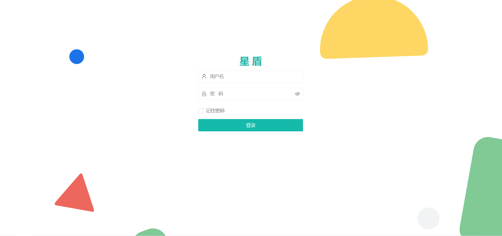
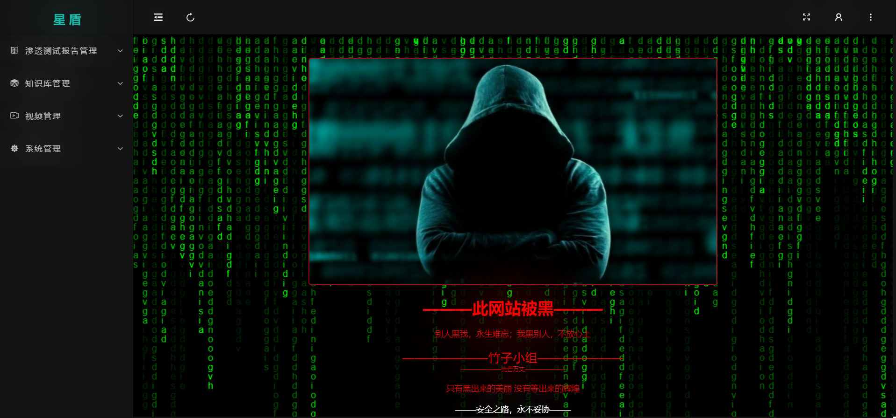
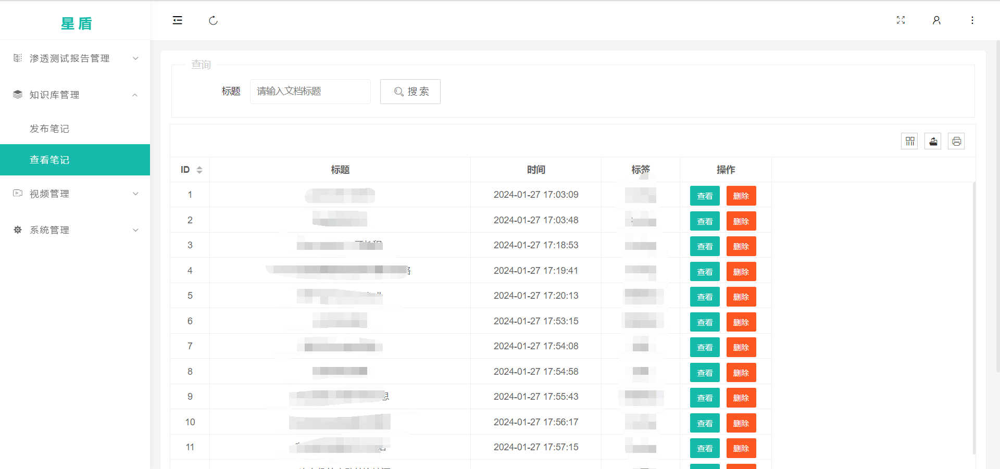
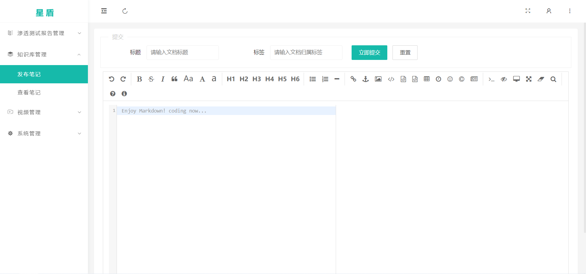
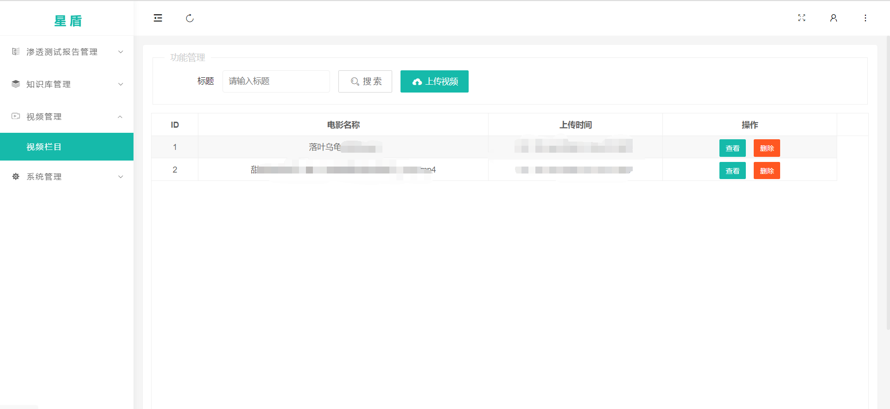
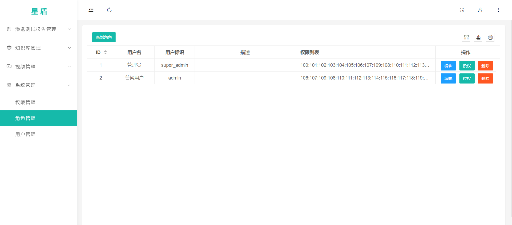

# **KBase_System**

> 项目：星盾
>
> Date：2023.12.29

技术栈：
1. html + css + jquery + bootstrap + layui + Ajax + SSR
2. python编程语言 + Flask框架 
3. Mysql8.0数据库存储数据
4. Ubuntu linux 20.04 
5. HLS + HTTP + ffmpeg分割Mp4为M3U8
6. Nginx反向代理

### **功能实现**
------------------------
#### 登录模块（完成）

1. 用户登录
2. 用户注册



#### 系统模块

**工作空间**

1. 首页，数据可视化显示个人数据；（当前总共文档数量、今日文档提交数量、各个用户文档数量、）



**知识库管理**

1. 笔记发布模块，实现用户在登录之后能发布文档等；

2. 查看笔记模块，用户可以查看、查询、删除文档；





**视频管理**
 
 视频上传模块，实现用户在登录之后能上传、查询、查看视频等功能；




**系统管理**

1. 角色管理，设置管理员用户、普通用户权限。（完成）
2. 用户管理，管理员对用户进行添加，修改，删除。（完成）




**渗透测试报告管理**

实现快速编写渗透测试报告的功能，目前还在写ing


**环境配置**

```python
#安装虚拟环境
python -m venv venv

# 在虚拟环境中 更新pip
python -m pip install --upgrade pip -i https://pypi.tuna.tsinghua.edu.cn/simple some-package

# 安装依赖 
pip install -r requirements.txt -i https://pypi.tuna.tsinghua.edu.cn/simple some-package


# 运行项目
flask run
```


SSR(Server Side Rendering) ：传统的渲染方式，由服务端把渲染的完整的页面吐给客户端。这样减少了一次客户端到服务端的一次http请求，加快相应速度，一般用于首屏的性能优化。
